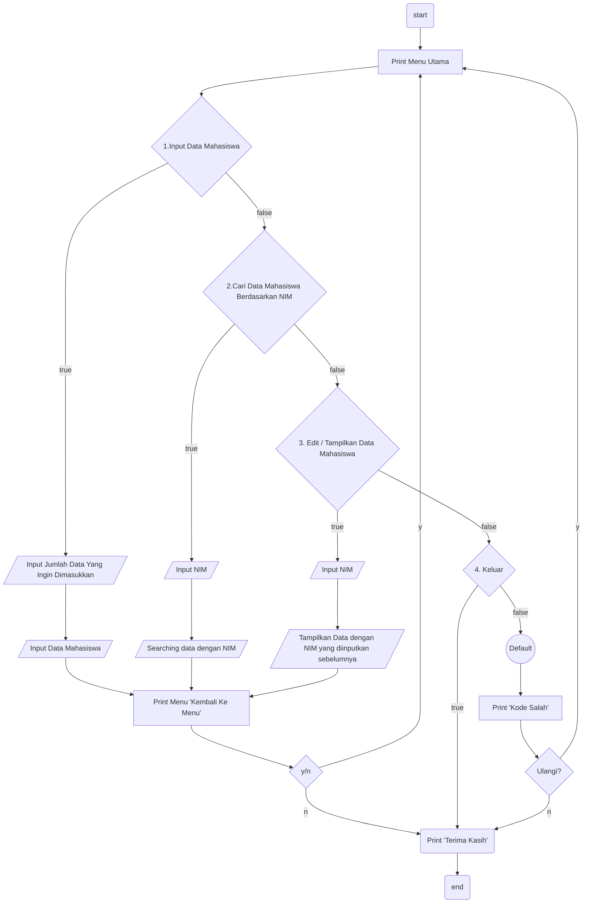

```mermaid    
    flowchart TD;
    A(start) --> B[Print Menu Utama];
    B --> C{1.Input Data Mahasiswa};
    C --true--> D[/Input Jumlah Data Yang Ingin Dimasukkan/];
    C --false--> E{2.Cari Data Mahasiswa Berdasarkan NIM};
    D --> F[/Input Data Mahasiswa/];
    F --> G[Print Menu 'Kembali Ke Menu'];
    G --> H{y/n};
    H --y--> B[Print Menu Utama];
    H --n--> K(Print 'Terima Kasih');
    E --true--> I[/Input NIM/];
    I --> J[/Searching data dengan NIM/];
    J --> G[Print Menu 'Kembali Ke Menu'];
    E --false--> L{3. Edit / Tampilkan Data Mahasiswa};
    L --true--> M[/Input NIM/];
    M --> N[/Tampilkan Data dengan NIM yang diinputkan sebelumnya/];
    N --> G[Print Menu 'Kembali Ke Menu'];
    L --false--> O{4. Keluar};
    O --true--> K(Print 'Terima Kasih');
    O --false--> P((Default));
    P --> Q[Print 'Kode Salah'];
    Q --> T{Ulangi?};
    T --y--> B[Print Menu Utama];
    T --n--> K(Print 'Terima Kasih');
    K --> R(end)
    
```
