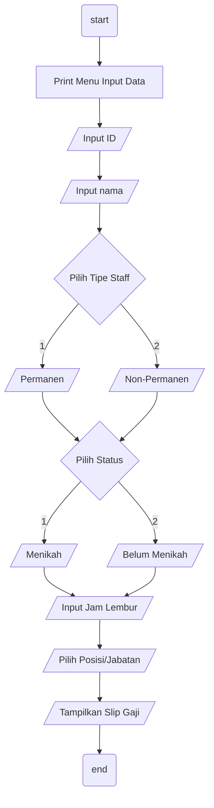

```mermaid    
    flowchart TD;
    A(start) --> B[Print Menu Input Data];
    B --> C[/Input ID/];
    C --> D[/Input nama/];
    D --> E{Pilih Tipe Staff};
    E --1--> F[/Permanen/];
    E --2--> G[/Non-Permanen/];
    F --> H{Pilih Status};
    G --> H{Pilih Status};
    H --1--> I[/Menikah/];
    H --2--> J[/Belum Menikah/];
    I --> K[/Input Jam Lembur/];
    J --> K[/Input Jam Lembur/];
    K --> L[/Pilih Posisi/Jabatan/];
    L --> M[/Tampilkan Slip Gaji/];
    M --> N(end)
```